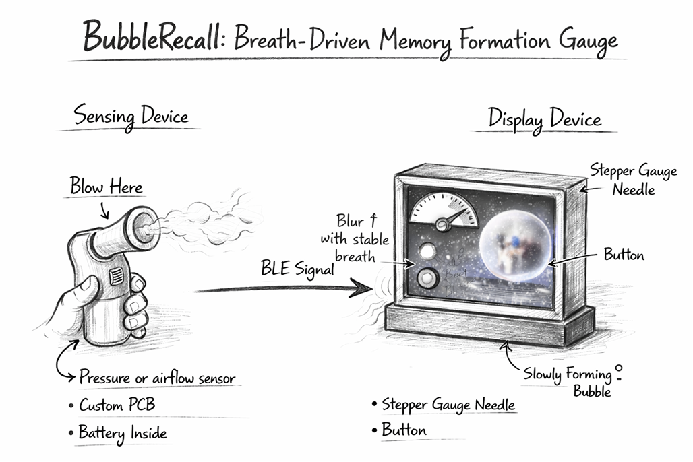
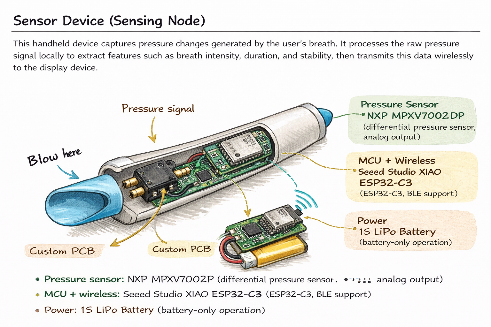
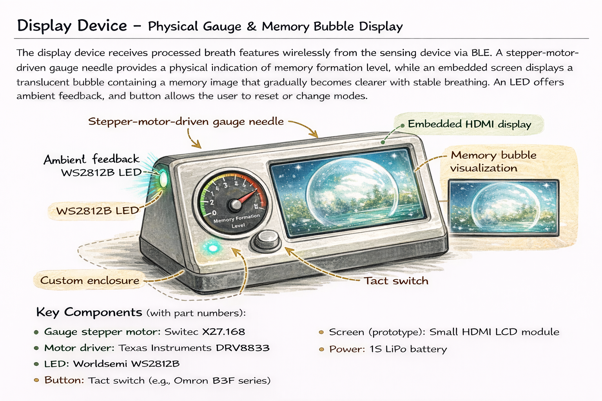
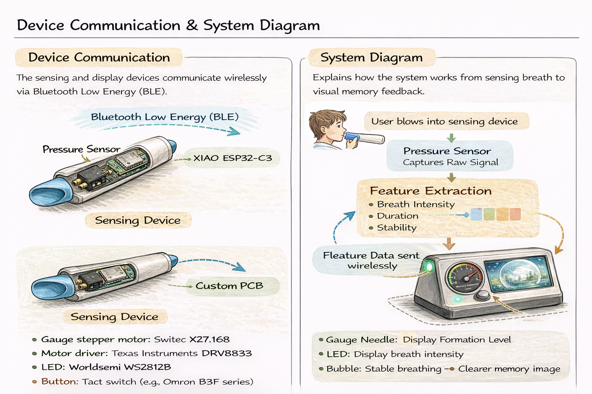

# BubbleRecall
Breath-driven memory formation gauge

## **Section 1 — Project Overview**

### **BubbleRecall — Breath-Driven Memory Formation Gauge**

BubbleRecall is a two-device interactive system inspired by the childhood act of blowing bubbles. By analyzing breath intensity and stability, the system visualizes memory as a fragile process that gradually forms through calm, sustained interaction rather than instant recall.

**General appearance (sketch description):**
The system consists of a handheld blow-nozzle sensing device and a desktop display device. The sensing device resembles a small bubble blower, while the display device features a physical gauge needle, an ambient LED, a button, and an embedded screen showing a forming memory bubble.




## **Section 2 — Sensor Device (Sensing Node)**

**Description:**
The sensing device captures pressure changes generated by the user’s breath. The raw pressure signal is smoothed and processed locally to extract features such as breath intensity, duration, and stability, which are then transmitted wirelessly to the display device.

**Key components (with part numbers):**

* **Pressure sensor:** NXP **MPXV7002DP** (differential pressure sensor, analog output)
* **MCU + wireless:** Seeed Studio **XIAO ESP32-C3** (ESP32-C3, BLE support)
* **Power:** 1S LiPo battery (battery-only operation)

**Sketch description:**
A handheld device with a blow nozzle, internal pressure sensor, battery, and custom PCB integrating the ESP32-C3 module.




## **Section 3 — Display Device (Physical Gauge + Visual Bubble)**

**Description:**
The display device receives breath features via BLE and provides both physical and visual feedback. A stepper-motor-driven gauge needle indicates the level of memory formation, while an embedded screen displays a translucent bubble containing a memory image that gradually becomes clearer with stable breathing. An LED provides ambient feedback, and a button allows reset or mode switching.

**Key components (with part numbers):**

* **Gauge stepper motor:** **Switec X27.168**
* **Motor driver:** Texas Instruments **DRV8833**
* **LED:** Worldsemi **WS2812B**
* **Button:** Tact switch (e.g., Omron **B3F** series)
* **Screen (prototype):** Small **HDMI LCD** module
* **Power:** 1S LiPo battery (larger capacity for motor and display)

**Sketch description:**
A desktop enclosure with a visible gauge needle, LED indicator, button, and a screen showing the forming memory bubble.




## **Section 4 — Device Communication and System Diagram**

### **Figure 1: Device Communication**

The sensing device and display device communicate wirelessly using Bluetooth Low Energy (BLE).


### **Figure 2: System Data Flow Diagram**

```
Blow (pressure signal)
   ↓  (moving average / smoothing)
Feature extraction: intensity, duration, stability
   ↓  (BLE transmission)
Display device receives features
   ├─ Gauge needle position = memory formation level
   ├─ LED brightness = breath intensity
   └─ Bubble image: blur decreases with stable breath,
                    blur increases when breath stops
```

**Explanation:**
Processing is split between devices to reduce wireless bandwidth and power consumption. The sensing device transmits compact feature data rather than raw signals, allowing the display device to respond smoothly and in real time.

（All sketches and diagrams shown in this README were created using Figma Make for concept visualization and system illustration.）
